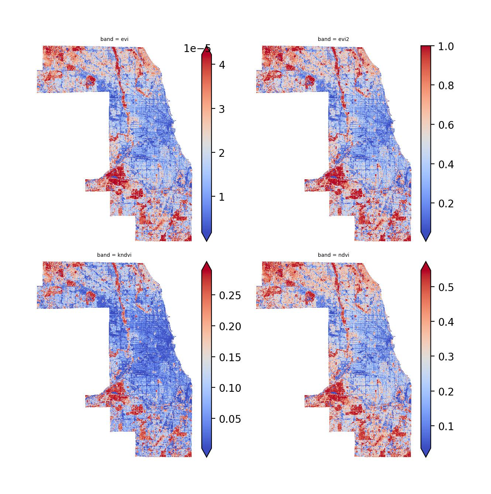

# Relationship between Vegetation Indices and Social Vulnerability in Cook County, Illinois

**Authors:** Alex Michels and Tyler Stewart

This notebook walks through calculating vegetation indices VI in Cook County, Illinois and calculating the correlations between the VI and the CDC Social Vulnerability Index (SVI). This notebook uses the [geowombat](https://geowombat.readthedocs.io/en/latest/) package.

